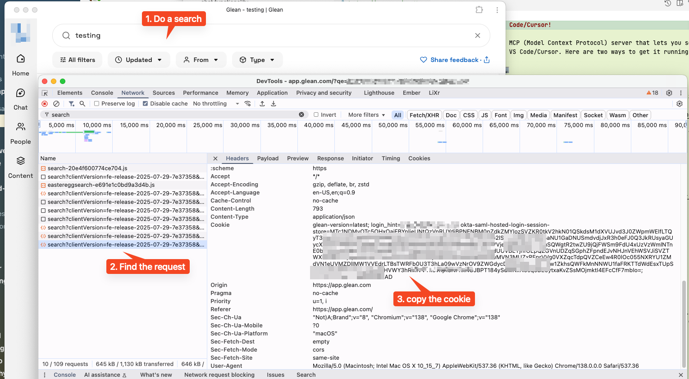

# Glean MCP Server

A Model Context Protocol (MCP) server that provides search functionality for Glean knowledge bases in Cursor and VS Code.

## 🚀 Latest Release: v1.7.1

**Complete Feature Parity with Official Glean MCP Server!**

✅ **Fixed**: Docker container import error from v1.7.0
✅ **New**: `read_documents` tool for full document retrieval by ID or URL
✅ **Complete**: All three core tools from the official Glean MCP server

[📋 View Release Notes](https://github.com/alankyshum/glean-mcp-server/releases/tag/v1.7.1) | [🐳 Container Images](https://github.com/alankyshum/glean-mcp-server/pkgs/container/glean-mcp-server)

## ✨ Key Features

- **Complete Feature Parity**: All three tools from the official Glean MCP server
- **Document Retrieval**: Full document content by ID or URL (Google Docs, Sheets, etc.)
- **AI-Powered Research**: Get comprehensive answers with citations using Glean's chat AI
- **Fast Search**: Efficient search across your company's knowledge base
- **Optimized Responses**: Advanced filtering reduces response size by 85-98% while preserving all useful information
- **Easy Setup**: Simple Docker-based deployment with environment variable configuration
- **Flexible Configuration**: Customizable page sizes, snippet lengths, and tool descriptions

## Quick Setup for Cursor/VS Code

### 1. Get Authentication Cookies

1. Open your browser and navigate to your Glean instance (e.g., `https://company.glean.com`)
2. Make sure you're logged in
3. Open Developer Tools (F12) → Network tab
4. Perform a search in Glean to trigger API requests
5. Find any search API request in the Network tab
6. Right-click the request → Copy → Copy as cURL
7. Extract the entire `Cookie` header value from the cURL command

See this image:


### 2. Configure MCP in Cursor/VS Code

Add this to your MCP settings file (see `mcp-settings-example.json` for reference):

**For Cursor:** `~/Library/Application Support/Cursor/User/globalStorage/rooveterinaryinc.roo-cline/settings/cline_mcp_settings.json`

**For VS Code:** `~/.vscode/settings.json` (add to existing file)

```json
{
  "mcp": {
    "mcpServers": {
      "glean": {
        "command": "docker",
        "args": [
          "run", "--rm", "-i",
          "--pull", "always",
          "-e", "GLEAN_BASE_URL=https://your-company.glean.com",
          "-e", "GLEAN_COOKIES=your_cookie_string_here",
          "-e", "GLEAN_TOOL_DESCRIPTION=Search your company's knowledge base",
          "ghcr.io/alankyshum/glean-mcp-server:latest"
        ]
      }
    }
  }
}
```

**Replace:**
- `your-company.glean.com` with your actual Glean instance URL
- `your_cookie_string_here` with the cookies from step 1

### 3. Alternative: Local Installation

If you prefer not to use Docker:

```bash
# Install the server
pip install -r requirements.txt

# Set environment variables
export GLEAN_BASE_URL=https://your-company.glean.com
export GLEAN_COOKIES="your_cookie_string"

# Configure MCP to use local installation
```

```json
{
  "mcp": {
    "mcpServers": {
      "glean": {
        "command": "python",
        "args": ["/path/to/glean-mcp-server/src/glean_mcp_server.py"],
        "env": {
          "GLEAN_BASE_URL": "https://your-company.glean.com",
          "GLEAN_COOKIES": "your_cookie_string_here"
        }
      }
    }
  }
}
```

## 🔄 Upgrading to Latest Version

The configuration above uses `--pull always` to automatically get the latest container release. To upgrade:

1. **Restart Cursor/VS Code** - The next search will automatically pull the latest image
2. **Manual update** (optional): `docker pull ghcr.io/alankyshum/glean-mcp-server:latest`

For specific versions, replace `:latest` with `:v1.7.1` or your desired version tag.

## Usage

Once configured, you can interact with your Glean knowledge base directly from Cursor/VS Code using three powerful tools:

### Search Tool
- **Tool name:** `glean_search`
- **Purpose:** Find specific documents and information
- **Parameters:**
  - `query` (required): Your search query
  - `page_size` (optional): Number of results (default: 14)
  - `max_snippet_size` (optional): Snippet size (default: 215)

### Research Tool
- **Tool name:** `glean_research`
- **Purpose:** Get AI-powered answers and insights from your knowledge base
- **Parameters:**
  - `query` (required): Your research question or topic

### Document Reader Tool ✨ **NEW in v1.7.0**
- **Tool name:** `read_documents`
- **Purpose:** Retrieve full document content by ID or URL
- **Parameters:**
  - `documentSpecs` (required): Array of document specifications
    - Each spec can have either `id` (Glean document ID) or `url` (document URL)
- **Supports:** Google Docs, Sheets, Slides, and other document types
- **Features:** Full content extraction, metadata parsing, human-readable formatting

The research tool uses Glean's AI chat functionality to provide comprehensive answers with citations, the search tool returns raw search results for targeted document discovery, and the document reader tool retrieves complete document content for detailed analysis.

## Configuration Options

| Environment Variable         | Required | Default                                     | Description                                    |
|------------------------------|----------|---------------------------------------------|------------------------------------------------|
| `GLEAN_BASE_URL`             | **Yes**  | -                                           | Your Glean instance URL                        |
| `GLEAN_COOKIES`              | **Yes**  | -                                           | Authentication cookies from browser            |
| `GLEAN_TOOL_DESCRIPTION`     | No       | `"Search for internal company information"` | Custom description for the search tool         |
| `GLEAN_DEFAULT_PAGE_SIZE`    | No       | `14`                                        | Default number of search results               |
| `GLEAN_DEFAULT_SNIPPET_SIZE` | No       | `215`                                       | Default snippet size for results               |
| `GLEAN_AUTO_OPEN_BROWSER`    | No       | `true`                                      | Automatically open browser when cookies expire |

### Example with Custom Description
```json
{
  "mcp": {
    "mcpServers": {
      "glean": {
        "command": "docker",
        "args": [
          "run", "--rm", "-i",
          "-e", "GLEAN_BASE_URL=https://acme.glean.com",
          "-e", "GLEAN_COOKIES=your_cookie_string_here",
          "-e", "GLEAN_TOOL_DESCRIPTION=Search ACME Corp's internal knowledge base",
          "-e", "GLEAN_DEFAULT_PAGE_SIZE=20",
          "ghcr.io/alankyshum/glean-mcp-server:latest"
        ]
      }
    }
  }
}
```

## Testing Your Setup

Before using in Cursor/VS Code, test your configuration:

```bash
# Copy and edit the environment file
cp .env.example .env
# Edit .env with your Glean URL and cookies

# Test the connection
python test_server.py
```

## 🔄 Cookie Management & Renewal

### Automatic Cookie Expiration Detection

The MCP server automatically detects when your Glean cookies have expired and provides helpful guidance:

- **Smart Detection**: Validates cookies before each request
- **Auto Browser Opening**: Automatically opens your Glean instance to help with renewal
- **Detailed Instructions**: Step-by-step guidance for cookie extraction
- **Multiple Update Methods**: Supports both Docker and local installation workflows

### When Cookies Expire

If your cookies expire, you'll see a helpful error message with:

1. **Automatic browser opening** to your Glean instance (if enabled)
2. **Step-by-step renewal instructions**
3. **Multiple update methods** for different installation types
4. **Direct links** to renewal helper scripts

### Cookie Renewal Options

#### Option 1: Manual Update (Recommended for MCP)
1. Follow the error message instructions to get new cookies
2. Update your MCP configuration file with fresh cookies
3. Restart Cursor/VS Code to reload the MCP server

#### Option 2: Interactive Renewal (for local development)
```bash
# Test cookie validation and renewal interactively
python scripts/interactive-cookie-renewal.py

# Test chat functionality specifically
python scripts/interactive-cookie-renewal.py chat
```

#### Option 3: Automated Scripts
```bash
# Extract cookies from a cURL command
python scripts/extract-cookies-from-curl.py --interactive

# Update cookies in environment file
python scripts/update-cookies.py "your_new_cookies_here"
```

### Cookie Validation

The client automatically validates cookies by:
- Making lightweight test requests before actual operations
- Attempting automatic renewal if a callback is provided
- Providing clear error messages with renewal instructions

### Best Practices

- **Monitor expiration**: Cookies typically last 24-48 hours
- **Automate renewal**: Use the provided scripts for faster updates
- **Keep backup**: Save your cookie extraction cURL commands
- **Test regularly**: Use the interactive test script to verify connectivity

## Troubleshooting

### Authentication Issues
- **Cookies expired**: Run `python scripts/check-cookies.py` to verify
- **Quick renewal**: Use `python scripts/update-cookies.py "new_cookies"`
- Verify your Glean URL is correct
- Check that you have access to the Glean instance

### Docker Issues
- Make sure Docker is running
- Pull the latest image: `docker pull ghcr.io/alankyshum/glean-mcp-server:latest`

### MCP Configuration Issues
- Restart Cursor/VS Code after configuration changes
- Check the MCP settings file path is correct for your OS
- Verify JSON syntax is valid

## 🚀 Performance Optimization

This server includes advanced response filtering that dramatically improves performance:

- **85-98% smaller responses** compared to raw Glean API
- **Faster search results** with reduced data transfer
- **Clean, focused data** with only relevant information
- **Preserved functionality** - all useful content and metadata retained

Example compression:
```
Query: "documentation"
Raw response: 195,593 characters → Filtered: 2,994 characters (98.5% reduction)
```

For more details, see [FILTERING.md](FILTERING.md).

## 🧪 Testing and Development

Test the filtering and API functionality:

```bash
# Test with default queries
python3 scripts/test_and_filter.py

# Test specific queries
python3 scripts/test_and_filter.py "machine learning" "kubernetes"

# Customize result size
python3 scripts/test_and_filter.py "query" --page-size 10 --snippet-size 300
```
